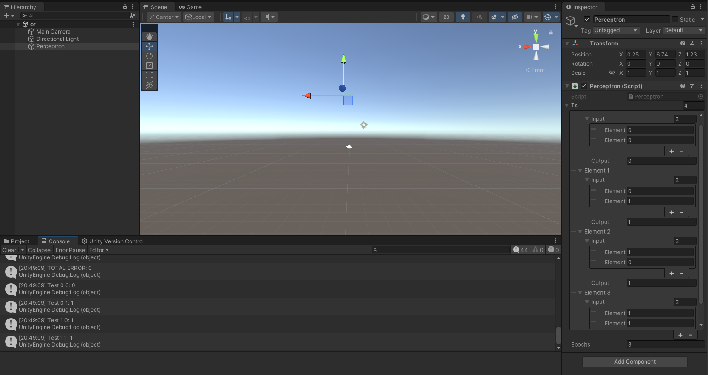
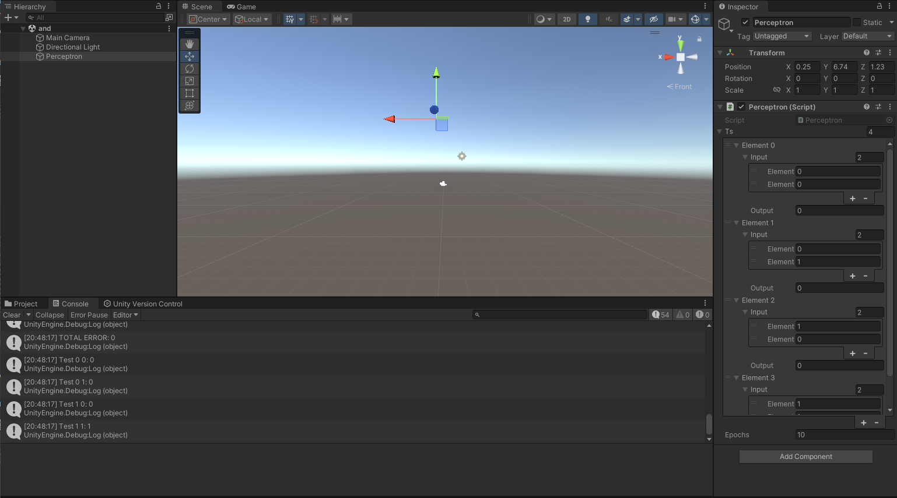
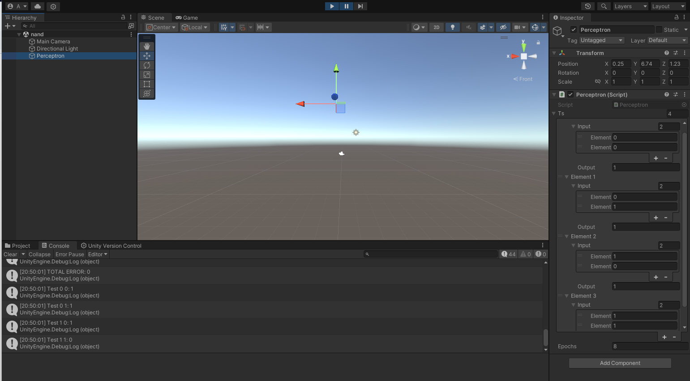
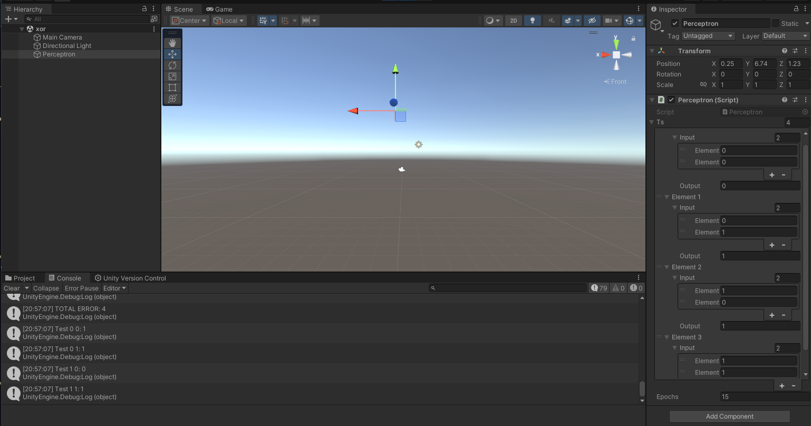
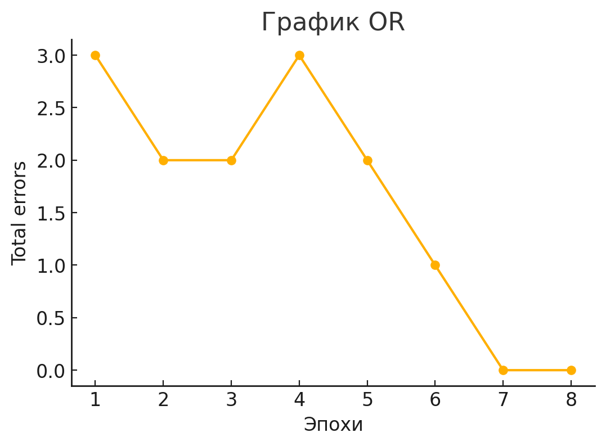
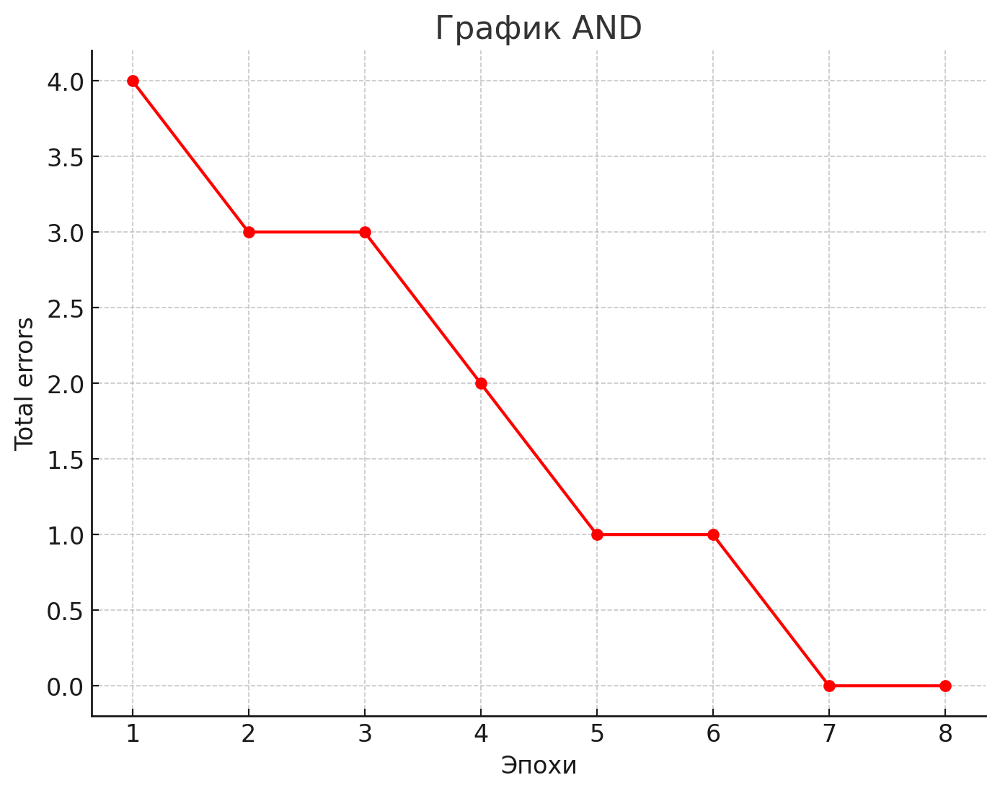
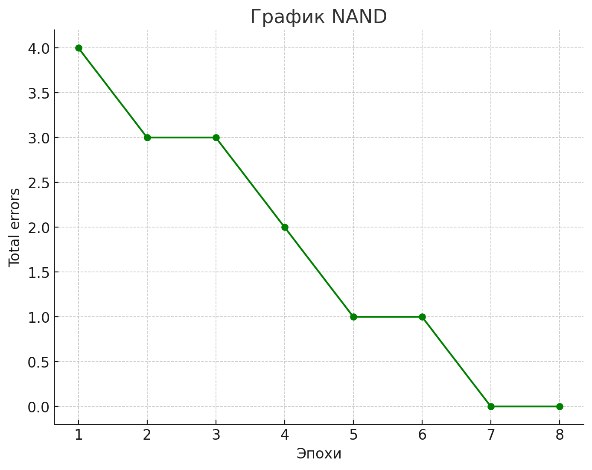
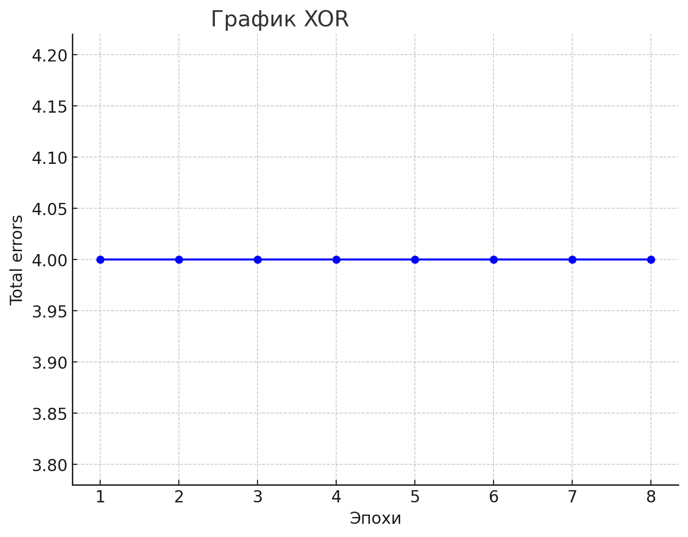
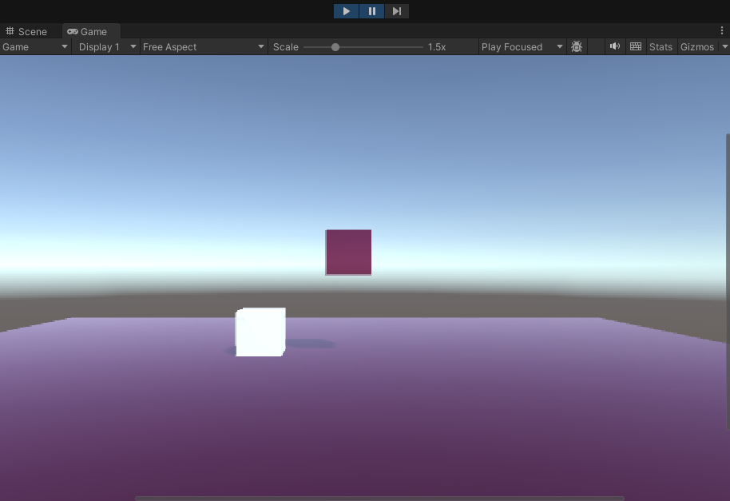
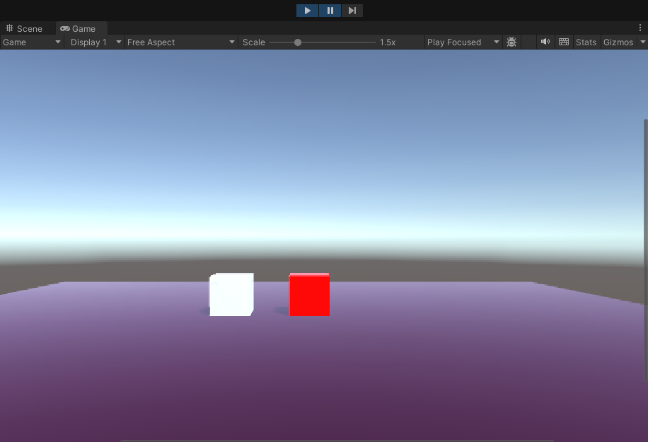

# DA-in-GameDev-lab4
# АНАЛИЗ ДАННЫХ И ИСКУССТВЕННЫЙ ИНТЕЛЛЕКТ [in GameDev]
Отчет по лабораторной работе #4 выполнил:
- Шумов Никита Артёмович
- РИ232702

| Задание | Выполнение | Баллы |
| ------ | ------ | ------ |
| Задание 1 | * | 60 |
| Задание 2 | * | 20 |
| Задание 3 | * | 20 |

## Цель работы
Познакомиться с программными средствами для создания системы искусственного интеллекта и их применение совместно с Unity.

## Задание 1
В проекте Unity реализовать перцептрон, который умеет призводить следующие вычисления:
- **OR**
- **AND**
- **NAND**
- **XOR**
- **Дать комментарии о корректности работы всех логических операций после реализации**

Мы создали новый 3D-проект в Unity и добавили на сцену пустой объект. Затем написали скрипт и вставили в него следующий код. После этого прикрепили скрипт к пустому объекту.

## Вычисление **OR**
В Unity, на пустом объекте, мы заполнили список Ts, содержащий данные для обучения перцептрона. Эти значения соответствовали результатам логической операции "ИЛИ" для бинарного сложения

## Вычисление **AND**

## Вычисление **NAND**

## Вычисление **XOR**
XOR представляет собой набор нелинейно связанных данных. Из-за этой особенности перцептрон не способен корректно их обработать, так как он рассчитан исключительно на работу с линейно разделимыми данными. В результате, попытка обучить перцептрон на таких данных неизбежно приведет к ошибке. Для работы с XOR и другими нелинейными задачами требуется использовать более сложные архитектуры, такие как многослойный перцептрон (MLP) с использованием функции активации.

## Задание 2

Количество эпох обучения напрямую зависит от сложности логической операции, которую пытаемся воспроизвести с помощью перцептрона.

В случае XOR, график демонстрирует, что перцептрон не способен обучиться данной операции, поскольку ошибки остаются неизменными (на уровне 4). Это подтверждает, что для обработки нелинейных зависимостей, таких как XOR, требуется использование более сложных архитектур, например, многослойного перцептрона.

## Задание 3

Давайте создадим визуальную модель работы перцептрона, реализующего операцию AND. Изменим скрипт таким образом, чтобы если перцептрон в процессе обучения достиг ошибки меньше единицы, то записывал `true` в переменную `flag`. Затем, используя эту переменную, будем изменять цвет объекта при его касании с землёй. Если перцептрон обучился, то цвет куба станет красным, в противном случае цвет останется прежним.

## Выводы
На практике мы изучили возможности и ограничения перцептрона, разобрав его работу на примерах линейных и нелинейных данных. Убедились, что он эффективно справляется с задачами для линейно разделимых данных, но не подходит для обработки нелинейных зависимостей, таких как XOR. Кроме того, мы получили дополнительный опыт работы с Unity, что позволило нам интегрировать скрипты и данные для визуализации процесса обучения.
